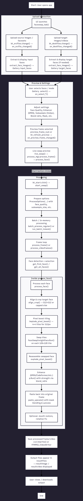

# Roop-Unleashed-Pinokio (Enhanced Face Swap)

**A powerful, user-friendly fork of Roop with Pinokio integration, advanced face swapping, pixel-boost upscaling, and quality mode enhancements.**

This fork improves the original Roop-Unleashed experience with:
- Reliable higher-resolution face swapping (up to 512px tiling, capped for stability)
- Selectable "Face Quality" modes (Balanced / High / Ultra) for sharper, less pixelated results
- Stronger enhancer control (GPEN default + blend ratio override)
- Fixed parsing, alignment, and paste-back issues for 256/512px subsamples
- Clean Pinokio launch support

## Workflow Diagram

The complete face swap process from upload to output:

*(Diagram shows the full pipeline: upload → face extraction → preview → processing → tiling/swap/enhance → paste-back → output)*

## Features

- **Multiple face selection modes**: First found, All faces, Selected face, All female/male
- **Advanced subsampling (Pixel Boost)**: 128px → 512px tiling (4×4 tiles at 512px) for much sharper faces
- **Face Quality Mode** (custom addition):
  - Balanced → standard speed/quality
  - High → 512px + stronger enhancement
  - Ultra → max detail + full enhancer strength
- **Preferred enhancer**: GPEN (photorealistic, sharp results) as default
- **Masking & restoration**: Clip2Seg / DFL XSeg, mouth restoration, manual masking
- **Preview & live swap**: Real-time frame preview with settings adjustments
- **Processing modes**: In-memory (fast) or extract frames (for large videos)
- **Output options**: File, Virtual Camera, or Both
- **Pinokio-ready**: One-click install & launch

## Requirements

- Windows (tested on Win10/11)
- NVIDIA GPU (RTX 4070 Laptop in your case) with CUDA support
- Pinokio installed
- At least 8 GB VRAM recommended for 512px mode (more for video)

## Installation (Pinokio)

1. Open Pinokio
2. Click "Discover" → search for "roop-unleashed-pinokio-eval-2" (or paste your GitHub URL)
3. Click "Install"
4. Wait for dependencies & models to download (~5–10 GB first time)
5. Click "Launch"

The app should open in your browser at `http://127.0.0.1:7860`.

## Quick Start Guide

1. **Add source faces**
   - Drag images or .fsz facesets to "Source Images or Facesets"
   - Faces appear in the left gallery

2. **Add target media**
   - Drag image/video to "Target File(s)"
   - Preview frame slider appears

3. **Select faces & settings**
   - Click desired source face(s)
   - Choose swap mode (e.g. "First found" or "Selected face")
   - Set:
     - Enhancer → **GPEN** (recommended)
     - Subsample upscale to → **512px**
     - Face Quality Mode → **Ultra** or **High**
     - Blend ratio → 0.8–1.0 for strong enhancement

4. **Preview**
   - Move frame slider or click "Refresh"
   - See live swapped preview

5. **Run**
   - Choose output method (File / Virtual Camera / Both)
   - Click "Start"
   - Progress bar shows frame processing
   - Output files appear in `/output/` folder

## Troubleshooting

| Problem                            | Likely Cause                              | Solution |
|------------------------------------|-------------------------------------------|----------|
| Grey box / empty face              | Overscaled paste at high subsample        | Use 512px max; cap in ProcessMgr.py if needed |
| "Not using" enhancer message       | Missing model file                        | Download GPEN .pth files → place in `/app/models/` |
| Crash on 1024px                    | Tiling / alignment overflow               | Capped to 512px in code — safe fallback |
| Slow processing                    | High subsample + video length             | Use In-Memory mode, lower subsample to 256px, or fewer threads |
| No "Face Quality Mode" dropdown    | Not added to faceswap_tab.py              | Add `gr.Dropdown` as shown in earlier instructions |

## Credits

- Original Roop: https://github.com/s0md3v/roop
- Roop-Unleashed base: https://github.com/C0untFloyd/roop-unleashed
- Pinokio wrapper & enhancements: @adutchguy1986 (this fork)
- Face quality modes, parsing fixes, safeguards: Custom additions in this repo

## License

This project is based on open-source code under the AGPL-3.0 license (see original Roop repo).  
Use at your own risk — especially for real faces in sensitive contexts.

---

Enjoy sharper face swaps!  
If you run into issues or want to add more features (e.g. ReSwapper model support, batch folder processing), open an issue or let me know here. 🚀